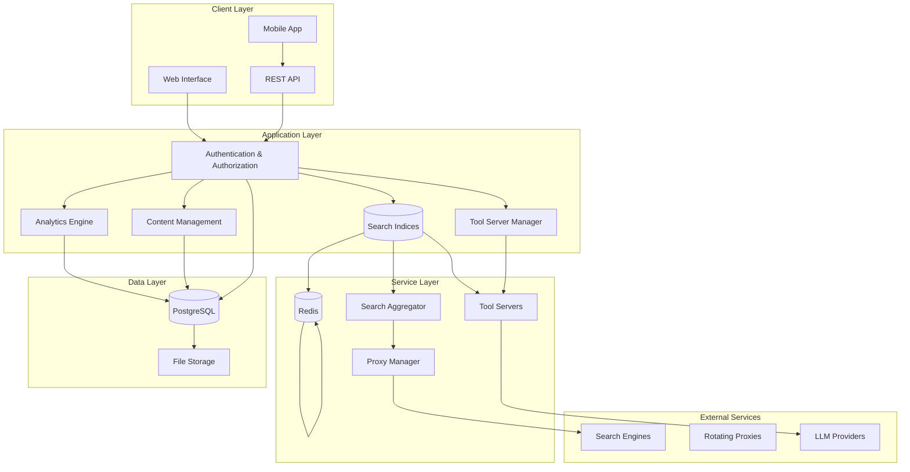

# Center-Deep Pro Architecture
## Enterprise Search Intelligence Platform

This document outlines the technical architecture, design decisions, and strategic positioning of Center-Deep Pro as an enterprise search intelligence platform.

---

## 🏗️ System Architecture

### High-Level Overview



---

## 🔍 Core Components

### 1. Search Orchestrator
**Purpose**: Coordinate search requests across multiple engines and tool servers

**Architecture**:
```python
class SearchOrchestrator:
    def __init__(self):
        self.engines = SearchEngineManager()
        self.tools = ToolServerManager()
        self.cache = CacheManager()
        self.analytics = AnalyticsEngine()
    
    async def execute_search(self, query: SearchQuery) -> SearchResults:
        # 1. Check cache
        # 2. Route to appropriate engines
        # 3. Aggregate results
        # 4. Apply tool enhancements
        # 5. Store analytics
        # 6. Return unified results
```

**Features**:
- Multi-engine result aggregation
- Intelligent query routing
- Real-time result deduplication
- Performance optimization
- Analytics integration

### 2. Tool Server Framework
**Purpose**: Extensible framework for search enhancement tools

**Tool Server Architecture**:
```python
# Base Tool Server Interface
class ToolServer:
    def __init__(self, config: ToolConfig):
        self.llm_client = LLMClient(config.llm_endpoint)
        self.embedding_client = EmbeddingClient(config.embedding_endpoint)
        self.cache = CacheClient(config.cache_url)
    
    async def process(self, request: ToolRequest) -> ToolResponse:
        # Implement specific tool logic
        pass
```

**Available Tool Servers**:
- **Search Tool**: Basic web search enhancement
- **Deep Search**: Multi-layer content analysis
- **Report Generator**: Automated document creation
- **Academic Research**: Scholarly search optimization

### 3. Authentication & Authorization
**Purpose**: Enterprise-grade security and access control

**RBAC Implementation**:
```yaml
roles:
  admin:
    permissions:
      - user_management
      - system_configuration
      - analytics_access
      - tool_server_management
  
  user:
    permissions:
      - basic_search
      - tool_server_access
      - personal_analytics
  
  viewer:
    permissions:
      - basic_search
      - read_only_access
```

### 4. Analytics Engine
**Purpose**: Comprehensive search intelligence and reporting

**Data Pipeline**:


---

## 🏢 Enterprise Features

### Multi-Tenancy Architecture
```python
class TenantManager:
    def __init__(self):
        self.tenant_resolver = TenantResolver()
        self.permission_manager = PermissionManager()
    
    def get_tenant_context(self, request):
        tenant = self.tenant_resolver.resolve(request)
        permissions = self.permission_manager.get_permissions(tenant)
        return TenantContext(tenant, permissions)
```

### Scalability Design
- **Horizontal Scaling**: Load balancer with multiple application instances
- **Database Scaling**: Read replicas and connection pooling
- **Cache Scaling**: Redis clustering for high availability
- **Tool Server Scaling**: Independent container scaling

### High Availability
- **Service Redundancy**: Multiple instances of each service
- **Database Failover**: PostgreSQL with streaming replication
- **Cache Failover**: Redis Sentinel for automatic failover
- **Health Monitoring**: Comprehensive health checks

---

## 🛠️ Tool Server Deep Dive

### Academic Research Tool
**Specialized for scholarly search**:

```python
class AcademicResearchTool(ToolServer):
    def __init__(self, config):
        super().__init__(config)
        self.citation_parser = CitationParser()
        self.scholar_apis = ScholarAPIManager()
    
    async def research_query(self, query: str) -> AcademicResults:
        # 1. Query academic databases
        # 2. Extract citations and metadata
        # 3. Generate literature review
        # 4. Format according to citation style
        return formatted_results
```

**Features**:
- Multiple citation formats (APA, MLA, Chicago, IEEE)
- Academic database integration
- Automatic literature review generation
- Citation analysis and recommendations

### Deep Search Tool
**Multi-layer content discovery**:

```python
class DeepSearchTool(ToolServer):
    async def deep_search(self, query: str, depth: int = 3) -> DeepResults:
        results = []
        for level in range(depth):
            # 1. Execute search at current level
            # 2. Extract relevant links
            # 3. Analyze content for additional queries
            # 4. Recurse to next level
            level_results = await self.search_level(query, level)
            results.extend(level_results)
        
        return self.synthesize_results(results)
```

### Report Generator Tool
**Automated document creation**:

```python
class ReportGeneratorTool(ToolServer):
    def __init__(self, config):
        super().__init__(config)
        self.template_engine = TemplateEngine()
        self.document_formatter = DocumentFormatter()
    
    async def generate_report(self, 
                            topic: str, 
                            report_type: ReportType) -> Document:
        # 1. Research topic comprehensively
        # 2. Structure information by report type
        # 3. Generate professional formatting
        # 4. Add citations and references
        return formatted_document
```

---

## 🚀 Performance Optimization

### Caching Strategy
```python
class CacheStrategy:
    def __init__(self):
        self.l1_cache = InMemoryCache(ttl=300)      # 5 minutes
        self.l2_cache = RedisCache(ttl=3600)        # 1 hour  
        self.l3_cache = DatabaseCache(ttl=86400)    # 24 hours
    
    async def get_or_compute(self, key: str, compute_func):
        # Check L1 (memory) cache
        if result := await self.l1_cache.get(key):
            return result
            
        # Check L2 (Redis) cache
        if result := await self.l2_cache.get(key):
            await self.l1_cache.set(key, result)
            return result
            
        # Check L3 (database) cache
        if result := await self.l3_cache.get(key):
            await self.l2_cache.set(key, result)
            await self.l1_cache.set(key, result)
            return result
            
        # Compute and cache at all levels
        result = await compute_func()
        await self.cache_at_all_levels(key, result)
        return result
```

### Search Optimization
- **Query Preprocessing**: Intelligent query enhancement and expansion
- **Result Deduplication**: Advanced algorithms for removing duplicate results
- **Relevance Scoring**: Machine learning-based relevance ranking
- **Parallel Processing**: Concurrent search across multiple engines

### Database Optimization
- **Connection Pooling**: Efficient database connection management
- **Query Optimization**: Indexed queries and query plan analysis
- **Partitioning**: Table partitioning for large datasets
- **Archiving**: Automated data lifecycle management

---

## 🔐 Security Architecture

### Defense in Depth


### Data Protection
- **Encryption at Rest**: Database and file encryption
- **Encryption in Transit**: TLS 1.3 for all communications
- **Key Management**: Secure key rotation and storage
- **Data Anonymization**: Privacy-preserving analytics

### Access Control
- **Zero Trust Architecture**: Verify every request
- **Multi-Factor Authentication**: Enhanced login security
- **Session Management**: Secure session handling
- **API Security**: OAuth 2.0 and API key management

---

## 📊 Monitoring & Observability

### Metrics Collection
```python
class MetricsCollector:
    def __init__(self):
        self.prometheus = PrometheusClient()
        self.custom_metrics = CustomMetrics()
    
    def record_search_latency(self, latency: float):
        self.prometheus.histogram('search_latency_seconds').observe(latency)
    
    def record_tool_usage(self, tool_name: str):
        self.prometheus.counter('tool_usage_total').labels(tool=tool_name).inc()
    
    def record_user_activity(self, user_id: str, action: str):
        self.custom_metrics.record_user_event(user_id, action)
```

### Health Monitoring
- **Service Health**: Comprehensive health checks for all services
- **Database Health**: Connection and performance monitoring
- **External Service Health**: Search engine and LLM availability
- **Resource Monitoring**: CPU, memory, and disk usage tracking

### Alerting
- **Performance Alerts**: Response time and error rate thresholds
- **Security Alerts**: Failed authentication and suspicious activity
- **Resource Alerts**: High resource usage and capacity planning
- **Business Alerts**: Usage patterns and feature adoption

---

## 🔄 Deployment Architecture

### Container Orchestration
```yaml
# Kubernetes Deployment Example
apiVersion: apps/v1
kind: Deployment
metadata:
  name: center-deep-pro
spec:
  replicas: 3
  selector:
    matchLabels:
      app: center-deep-pro
  template:
    metadata:
      labels:
        app: center-deep-pro
    spec:
      containers:
      - name: center-deep
        image: unicorn-commander/center-deep:latest
        ports:
        - containerPort: 8888
        env:
        - name: DATABASE_URL
          valueFrom:
            secretKeyRef:
              name: database-secret
              key: url
        - name: REDIS_URL
          value: "redis://redis-service:6379"
```

### Infrastructure as Code
- **Terraform**: Infrastructure provisioning and management
- **Helm Charts**: Kubernetes application deployment
- **Docker Compose**: Development and small-scale deployment
- **Ansible**: Configuration management and automation

### CI/CD Pipeline


---

## 📈 Scalability Patterns

### Microservices Architecture
- **Service Decomposition**: Each major feature as independent service
- **API Gateway**: Centralized routing and authentication
- **Service Mesh**: Inter-service communication and observability
- **Event-Driven Architecture**: Asynchronous processing with message queues

### Data Scaling
```python
class DatabaseSharding:
    def __init__(self):
        self.shards = {
            'shard_1': 'postgresql://db1:5432/center_deep',
            'shard_2': 'postgresql://db2:5432/center_deep',
            'shard_3': 'postgresql://db3:5432/center_deep'
        }
    
    def get_shard(self, tenant_id: str) -> str:
        shard_key = hash(tenant_id) % len(self.shards)
        return self.shards[f'shard_{shard_key + 1}']
```

### Cache Scaling
- **Distributed Caching**: Redis cluster for horizontal scaling
- **Cache Hierarchies**: Multiple cache levels for optimal performance
- **Cache Invalidation**: Smart invalidation strategies
- **Read-Through/Write-Behind**: Automated cache population

---

## 🆚 Architecture Comparison

### Center-Deep Pro vs Unicorn Search

| Component | Unicorn Search | Center-Deep Pro |
|-----------|----------------|-----------------|
| **Authentication** | None | Enterprise RBAC |
| **Database** | SQLite | PostgreSQL + Redis |
| **Scaling** | Single Instance | Horizontal Scaling |
| **Monitoring** | Basic Logs | Full Observability |
| **Security** | Basic | Enterprise Grade |
| **Tool Servers** | 4 Basic Tools | Full Suite + Custom |
| **API** | Simple REST | Enterprise API Gateway |
| **Deployment** | Docker Compose | Kubernetes + Docker |
| **Analytics** | None | Advanced Analytics |
| **Content Management** | None | Full CMS + Newsletter |

---

## 🛣️ Technology Roadmap

### Short Term (3 months)
- [ ] GraphQL API implementation
- [ ] Advanced search filters
- [ ] Mobile application
- [ ] Enhanced analytics dashboard

### Medium Term (6 months)
- [ ] Machine learning recommendations
- [ ] Advanced tool server framework
- [ ] Multi-language support
- [ ] Enterprise SSO integration

### Long Term (12 months)
- [ ] Federated search across enterprises
- [ ] Advanced natural language processing
- [ ] Predictive analytics
- [ ] White-label platform

---

## 📚 Technical Standards

### Code Quality
- **Type Safety**: Full TypeScript/Python typing
- **Testing**: 90%+ code coverage requirement
- **Documentation**: Comprehensive API and code documentation
- **Code Review**: Mandatory peer review process

### Security Standards
- **OWASP Compliance**: Follow OWASP Top 10 guidelines
- **Penetration Testing**: Regular security assessments
- **Vulnerability Management**: Automated security scanning
- **Compliance**: SOC 2, GDPR, HIPAA ready

### Performance Standards
- **Response Time**: <500ms for 95% of requests
- **Availability**: 99.9% uptime SLA
- **Scalability**: Support 10,000+ concurrent users
- **Data Processing**: Real-time analytics under 1 second

---

*Architecture designed and maintained by the Unicorn Commander engineering team.*
*For technical questions, contact: architecture@unicorncommander.com*