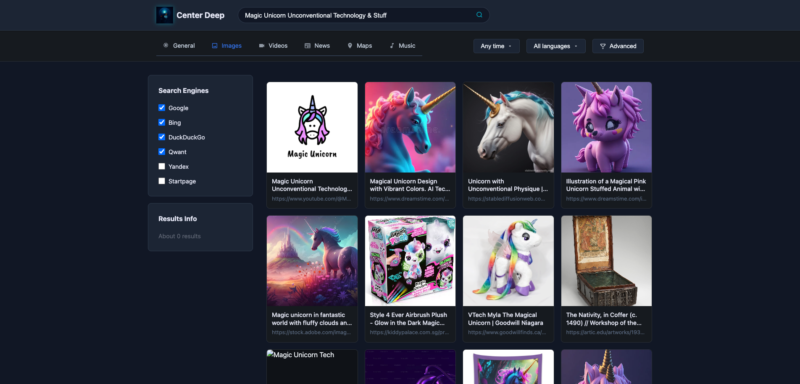
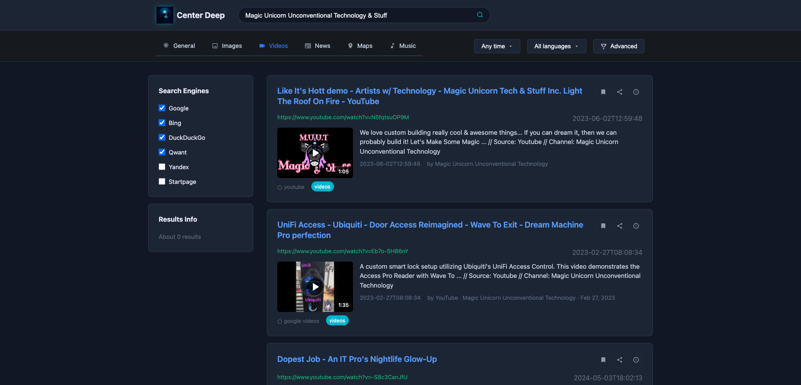
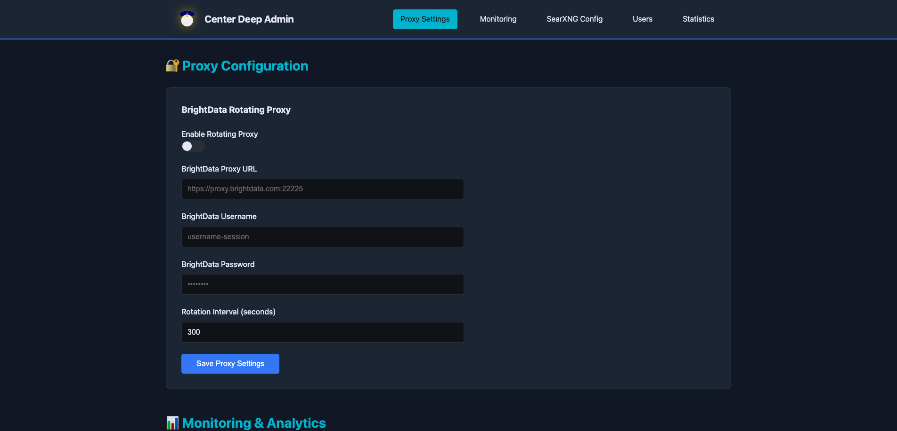

# Center Deep - Professional SearXNG Fork with AI Tool Servers

Center Deep is a professional, enterprise-ready fork of SearXNG metasearch engine with integrated OpenAI API v1 compatible tool servers. Designed for businesses and licensed individual installations, it provides advanced search capabilities, AI-powered analysis tools, and comprehensive administrative controls.


## 🚀 Quick Start

```bash
# Clone the repository
git clone https://github.com/MagicUnicornInc/Center-Deep.git
cd Center-Deep

# Run the installer
./install.sh

# Access the application
open http://localhost:8890
```

Default credentials: `ucadmin` / `MagicUnicorn!8-)`

## Professional Features

This is the licensed professional version of our SearXNG fork, available for UC-1-Pro enterprise deployments and licensed individual installations.

### 🔍 Enhanced Search Platform
- **Enterprise Admin Dashboard**: Complete control panel for system administrators
- **Rotating Proxy Support**: Built-in BrightData proxy integration for enhanced anonymity
- **Advanced Monitoring**: Prometheus and Grafana integration for real-time metrics
- **User Management**: Multi-user support with role-based access control
- **Professional UI**: Modern dark theme optimized for extended use
- **Real-time Analytics**: Live search statistics and usage monitoring

### 🤖 AI-Powered Tool Servers
- **OpenAI API v1 Compatible**: Works seamlessly with Open WebUI and other AI platforms
- **Docker-Based Architecture**: Each tool runs in its own container for scalability
- **LLM Configuration**: Assign different AI models to different tools
- **Admin Dashboard Control**: Start/stop/manage tool servers from the web interface

#### Available Tool Servers:
1. **Search Tool** (Port 8001)
   - Web search across multiple engines
   - GitHub, Reddit, Stack Overflow integration
   - Quick information retrieval

2. **Deep Search** (Port 8002)
   - Multi-level search with link following
   - Content extraction and analysis
   - Comprehensive research capabilities

3. **Report Generator** (Port 8003)
   - Professional report creation
   - Executive, technical, and analytical formats
   - Automatic citations and formatting

4. **Academic Research** (Port 8004)
   - Formal academic paper generation
   - APA, MLA, Chicago, IEEE citation styles
   - Literature review and bibliography

### 🔎 Search Capabilities
- **Multi-Engine Aggregation**: Simultaneous search across Google, Bing, DuckDuckGo, Qwant, and more
- **Category-Specific Results**: Optimized layouts for Images, Videos, News, Maps, and Music
- **Advanced Filtering**: Time range, language, and safe search controls
- **Privacy Options**: Optional client-side data storage for enhanced privacy

## Screenshots

### Search Results


### Image Search


### Video Results


### Settings Page


## Installation

### Automated Installation (Recommended)

Use our installation script for a complete setup:

```bash
./install.sh
```

The installer will:
- Check prerequisites (Docker, Docker Compose)
- Create necessary directories and configurations
- Build all Docker images
- Start Redis and SearXNG services
- Launch Center Deep application
- Provide access URLs and credentials

### Manual Installation

1. **Prerequisites**
   - Docker and Docker Compose
   - Python 3.11+ (for local development)
   - Git

2. **Clone and Setup**
```bash
git clone https://github.com/MagicUnicornInc/Center-Deep.git
cd Center-Deep
```

3. **Configure Environment**
```bash
cp .env.example .env
# Edit .env with your settings
```

4. **Build Images**
```bash
# Build main application
docker build -t center-deep:latest .

# Build tool servers
for tool in search deep-search report academic; do
    docker build -t center-deep-tool-$tool:latest ./toolserver/$tool
done
```

5. **Start Services**
```bash
# Start infrastructure
docker-compose up -d

# Start tool servers (optional)
docker-compose -f docker-compose.tools.yml up -d
```

6. **Access Application**
   - Main App: http://localhost:8890
   - Admin: http://localhost:8890/admin
   - SearXNG: http://localhost:8888

## 🔐 Security & Credentials

### Default Login
- Username: `ucadmin`
- Password: `MagicUnicorn!8-)`

**Important**: Change the default password immediately after first login.

### Security Features
- Password hashing with Werkzeug
- Session-based authentication
- Role-based access control
- Optional proxy support for anonymity
- Isolated Docker containers for tool servers

## ⚙️ Configuration

### Admin Dashboard Features

Access the comprehensive admin dashboard at `/admin` to manage:

#### 🔐 Proxy Settings
- Configure BrightData rotating proxies
- Set rotation intervals
- Monitor proxy status

#### 📊 Monitoring Integration
- Prometheus metrics export
- Grafana dashboard configuration
- Real-time performance tracking

#### 🔍 SearXNG Configuration
- Customize search engines
- Set default parameters
- Configure result limits

#### 🤖 LLM Configuration
- Add multiple LLM providers (OpenAI, Anthropic, etc.)
- Assign different models to different tools
- Configure temperature and token limits

#### 🛠️ Tool Server Management
- Start/stop individual tool servers
- View container logs
- Monitor health status
- Get integration URLs for Open WebUI

#### 👥 User Management
- Create and manage users
- Set admin privileges
- Password management
- Activity monitoring

### Search Preferences

Users can customize their search experience through the preferences page:

- Safe search settings
- Results per page
- Enabled search engines
- Theme and language preferences
- Local data tracking options

## 🏗️ Architecture

### Core Components
- **Backend**: Flask with SQLAlchemy for database management
- **Search Engine**: SearXNG metasearch engine integration
- **Database**: SQLite for user data and search logs
- **Caching**: Redis for real-time statistics and performance
- **Authentication**: Flask-Login for secure session management

### Tool Server Architecture
- **Framework**: FastAPI for high-performance API endpoints
- **Containerization**: Each tool runs in isolated Docker container
- **API Standard**: OpenAI API v1 compatible for broad integration
- **Communication**: RESTful APIs with JSON responses
- **Scalability**: Independent scaling of each tool server

### Integration with Open WebUI

Add these endpoints to Open WebUI's tool configuration:

```
http://localhost:8001  # Search Tool
http://localhost:8002  # Deep Search
http://localhost:8003  # Report Generator
http://localhost:8004  # Academic Research
```

## 🛠️ Development

### Project Structure
```
Center-Deep/
├── app.py                    # Main Flask application
├── docker-compose.yml        # Main services configuration
├── docker-compose.tools.yml  # Tool servers configuration
├── install.sh               # Automated installation script
├── requirements.txt         # Python dependencies
├── Dockerfile              # Main app container
├── templates/              # HTML templates
│   ├── admin.html         # Admin dashboard
│   ├── index.html         # Search homepage
│   └── search.html        # Search results
├── static/                 # Static assets
│   ├── css/              # Stylesheets
│   └── images/           # Logo and image assets
├── toolserver/            # AI Tool Servers
│   ├── search/           # Basic search tool
│   ├── deep-search/      # Deep analysis tool
│   ├── report/           # Report generator
│   └── academic/         # Academic paper tool
└── instance/              # Database (created on first run)
```

### Development Setup

1. **Create Virtual Environment**
```bash
python -m venv venv
source venv/bin/activate  # On Windows: venv\Scripts\activate
```

2. **Install Dependencies**
```bash
pip install -r requirements.txt
```

3. **Run in Development Mode**
```bash
export FLASK_ENV=development
python app.py
```

## 🔒 Security & Privacy

### Security Measures
- Password hashing with Werkzeug's PBKDF2
- Secure session management with Flask-Login
- CSRF protection on all forms
- Input validation and sanitization
- Isolated Docker containers for each service

### Privacy Features
- No tracking by default
- Optional client-side data storage
- Rotating proxy support
- Anonymous search capabilities
- No personal data collection without consent

### Best Practices
- Regular security updates
- Environment variable for secrets
- Minimal container privileges
- Network isolation between services

## 📄 Licensing

Center Deep is a commercial fork of SearXNG, developed by Magic Unicorn Unconventional Technology & Stuff Inc.

### License Types
- **Professional License**: Required for UC-1-Pro deployments and enterprise use
- **Individual License**: Available for personal professional installations
- **Base SearXNG**: Original SearXNG components maintain their AGPL-3.0 licensing

### What's Included
- ✅ Full source code access
- ✅ Admin dashboard and controls
- ✅ Tool server integration
- ✅ Priority support (with license)
- ✅ Commercial use rights (with license)

## 🤝 Support

- **Documentation**: See `/docs` folder
- **Issues**: GitHub Issues for bug reports
- **Commercial Support**: Available with professional license
- **Community**: Discussions via GitHub

## 🙏 Credits

Developed and maintained by **Magic Unicorn Unconventional Technology & Stuff Inc.**

Based on the open-source SearXNG project with significant enhancements for professional use.

### Technologies Used
- Flask & FastAPI
- Docker & Docker Compose
- SearXNG Metasearch Engine
- Redis for caching
- SQLite/PostgreSQL for data
- Modern JavaScript & CSS

---

*For licensing inquiries, contact Magic Unicorn Unconventional Technology & Stuff Inc.*