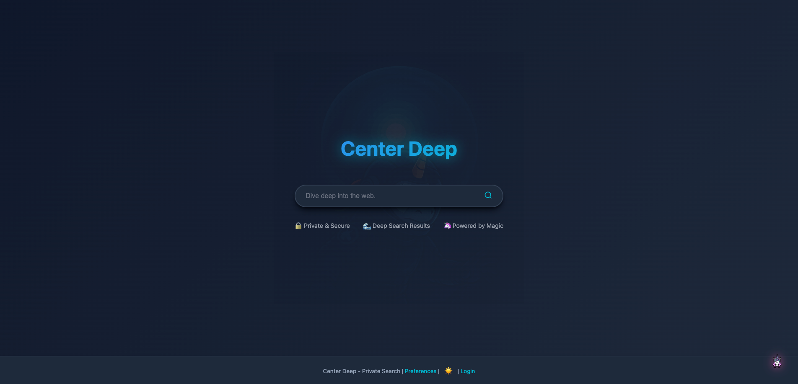
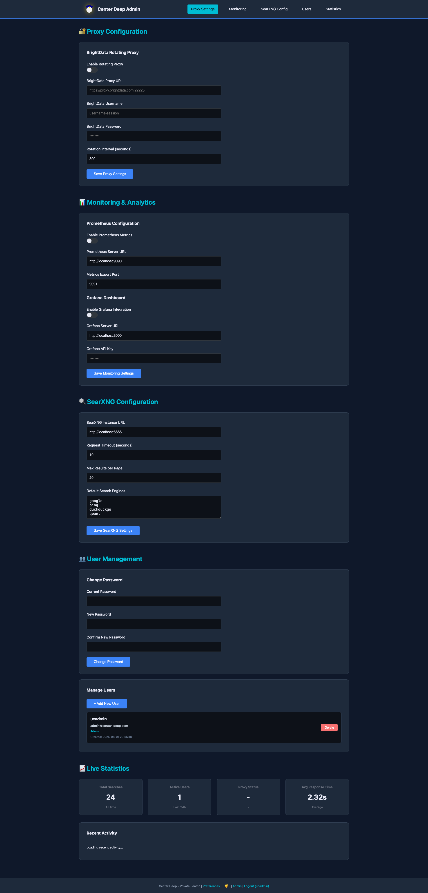
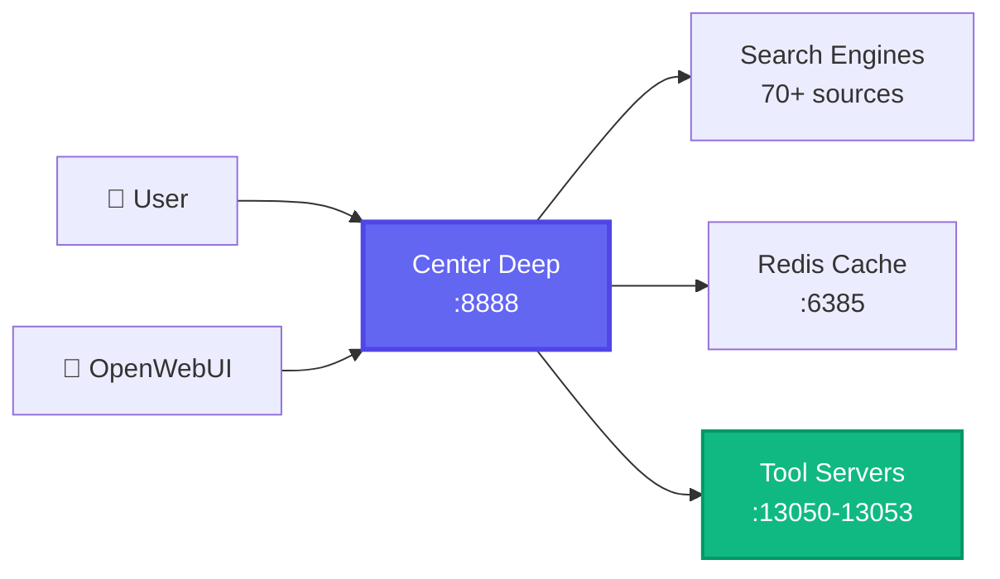

<div align="center">


# 🌊 Center Deep

## **The Privacy-First Meta-Search Engine That Killed SearXNG**

[](LICENSE_MIT)
[](docker-compose.yml)
[](https://github.com/open-webui/open-webui)
[](https://python.org)
[](https://github.com/Unicorn-Commander/Center-Deep)

### 🦄 **Built by [Magic Unicorn Unconventional Technology & Stuff Inc](https://magicunicorn.tech)**

**Center Deep isn't a fork. It's the evolution.** We took everything people loved about SearXNG, threw out what didn't work, and built the search engine that should have existed all along.

[**🚀 Get Started**](#-quick-start) • [**📸 Screenshots**](#-screenshots) • [**🆚 Compare Editions**](#-center-deep-vs-center-deep-pro) • [**💬 Discord**](#)

</div>

---

<div align="center">

## 🏆 **Why Developers Choose Center Deep**

</div>

<table>
<tr>
<td width="50%">

### ❌ **What You're Leaving Behind**
- 😴 **Dated UI** from 2015
- 📁 **Config file hell**
- 🔧 **Manual everything**
- 🐌 **Slow updates**
- 🚫 **No AI integration**
- 💀 **Zero user management**

</td>
<td width="50%">

### ✅ **What You're Getting**
- 🎨 **Gorgeous modern UI**
- 🎛️ **Web-based admin panel**
- 🤖 **AI-powered search tools**
- ⚡ **One-command deployment**
- 🔐 **Enterprise-ready auth**
- 📊 **Real-time analytics**

</td>
</tr>
</table>

---

## ⚡ **Quick Start**

### 🐳 **30 Seconds to Launch**

```bash
# Clone it
git clone https://github.com/Unicorn-Commander/Center-Deep.git && cd Center-Deep

# Run it
docker compose -f docker-compose.center-deep.yml up -d

# Use it
open http://localhost:8888
```

**That's it.** No BS. No 47-step configuration. It just works.

> 🔑 **Admin Panel**: `http://localhost:8888/admin` | Username: `ucadmin` | Password: `MagicUnicorn!8-)`

---

## 📸 **Screenshots**

<div align="center">

### **🏠 The Cleanest Search Interface Ever Built**


### **🔍 Search Results That Actually Make Sense**


### **⚙️ Admin Dashboard That Doesn't Suck**


</div>

---

## 🎯 **Core Features**

<div align="center">

| 🔒 **Privacy First** | 🤖 **AI Integration** | 🎨 **Beautiful UI** | ⚙️ **Admin Heaven** |
|:---:|:---:|:---:|:---:|
| Zero tracking | 4 OpenWebUI tools | Dark/Light themes | Web-based config |
| No cookies needed | LLM model discovery | Responsive design | User management |
| No ads ever | Tool server control | Floating mascot 🦄 | Real-time stats |
| IP rotation ready | Native integration | Clean results | One-click updates |

</div>

---

## 🆚 **Center Deep vs Center Deep Pro**

<div align="center">

### **Choose Your Fighter**

| Feature | 🆓 **Center Deep** <br>(Open Source) | 💼 **Center Deep Pro** <br>(Enterprise) |
|:--------|:----------------------------------:|:----------------------------------------:|
| **🔍 Core Search** | ✅ 70+ search engines | ✅ 70+ engines + priority results |
| **🤖 AI Tool Servers** | ✅ 4 basic tools | ✅ Unlimited custom tools |
| **👥 Users** | ✅ Unlimited local users | ✅ SSO/LDAP/OAuth2 |
| **📊 Analytics** | ✅ Basic statistics | ✅ Advanced dashboards + exports |
| **🌐 Proxy Support** | ✅ Basic proxy config | ✅ Rotating proxy pools |
| **📝 Content System** | ❌ | ✅ Blog + Newsletter platform |
| **🔗 API Access** | ✅ Basic API | ✅ Full REST API + webhooks |
| **🎨 Customization** | ✅ Themes | ✅ White-label + custom branding |
| **📞 Support** | Community | 24/7 Enterprise support |
| **💰 Price** | **FREE Forever** | **[Contact Sales](mailto:sales@unicorncommander.com)** |

</div>

> 🚀 **Need enterprise features?** [Get Center Deep Pro](mailto:sales@unicorncommander.com)

---

## 🛠️ **Tool Servers for OpenWebUI**

### **Turn Your LLM Into a Search Monster**

<table>
<tr>
<td width="25%">

### 🔍 **Search Tool**
Port: `13050`

Web, GitHub, Reddit, Stack Overflow - all in one

</td>
<td width="25%">

### 🔬 **Deep Search**
Port: `13051`

Multi-layer analysis with link following

</td>
<td width="25%">

### 📊 **Report Gen**
Port: `13052`

Professional reports with citations

</td>
<td width="25%">

### 🎓 **Academic**
Port: `13053`

Scholarly papers with proper formatting

</td>
</tr>
</table>

### **Integration is Dead Simple**

```bash
# Start tool servers
docker compose --profile tools -f docker-compose.center-deep.yml up -d

# Add to OpenWebUI
http://localhost:13050  # → Search Tool
http://localhost:13051  # → Deep Search
http://localhost:13052  # → Report Generator
http://localhost:13053  # → Academic Research
```

---

## 🏗️ **Architecture**

<div align="center">



</div>

---

## 💪 **Advanced Configuration**

<details>
<summary><b>🔧 Environment Variables</b></summary>

```env
# Redis Configuration
USE_EXTERNAL_REDIS=false        # BYO Redis
EXTERNAL_REDIS_HOST=localhost
EXTERNAL_REDIS_PORT=6379

# Admin Setup
ADMIN_USERNAME=ucadmin
ADMIN_PASSWORD=YourSecurePassword

# LLM Integration (Optional)
SEARCH_LLM_API_BASE=https://api.openai.com/v1
SEARCH_LLM_API_KEY=your-api-key
SEARCH_LLM_MODEL=gpt-4
```

</details>

<details>
<summary><b>🐳 Docker Compose Variants</b></summary>

```bash
# Production with SSL
docker compose -f docker-compose.prod.yml up -d

# Development mode
docker compose -f docker-compose.dev.yml up

# Custom Redis
USE_EXTERNAL_REDIS=true docker compose up -d

# With monitoring stack
docker compose --profile monitoring up -d
```

</details>

<details>
<summary><b>🔨 Manual Installation</b></summary>

```bash
# Create virtual environment
python3 -m venv venv && source venv/bin/activate

# Install dependencies
pip install -r requirements.txt

# Configure
cp .env.example .env
nano .env

# Initialize
python init_admin.py

# Launch
python app.py
```

</details>

---

## 🚀 **Roadmap**

### **🔜 Coming Soon™**

<table>
<tr>
<td width="50%">

#### **Open Source (Forever Free)**
- ✅ Core search functionality
- ✅ Admin dashboard
- ✅ Tool servers
- ✅ User management
- 🔄 Browser extensions
- 🔄 Mobile apps
- 🔄 Custom search operators
- 🔄 Search history (local only)

</td>
<td width="50%">

#### **Pro Edition (Enterprise)**
- 🎯 AI Agents & Scrapers
- 🎯 Advanced analytics
- 🎯 Full REST API
- 🎯 White-label options
- 🎯 Priority support
- 🎯 Custom integrations
- 🎯 Compliance tools
- 🎯 Audit logging

</td>
</tr>
</table>

---

## 🤝 **Contributing**

We're building the future of private search, and we want you to be part of it.

```bash
# Fork it
gh repo fork Unicorn-Commander/Center-Deep

# Branch it
git checkout -b feature/awesome-feature

# Commit it
git commit -m "Add awesome feature"

# Push it
git push origin feature/awesome-feature

# PR it
gh pr create
```

Check our [Contributing Guide](CONTRIBUTING.md) for the full details.

---

## 🛡️ **Security**

- 🔐 **Password hashing** with Werkzeug
- 🔒 **Session management** with Flask-Login
- 🛡️ **CSRF protection** on all forms
- 🚫 **Input sanitization** everywhere
- 📦 **Isolated containers** for each service
- 🔄 **Regular security updates**

Found a vulnerability? Email `security@unicorncommander.com` (we pay bounties!)

---

## 📚 **Documentation**

<div align="center">

| 📖 [Installation](docs/installation.md) | 🔧 [Configuration](docs/configuration.md) | 🔌 [API Docs](docs/api.md) | 🤖 [Tool Servers](docs/tool-servers.md) | ❓ [FAQ](docs/faq.md) |
|:---:|:---:|:---:|:---:|:---:|

</div>

---

## 💬 **Community & Support**

<div align="center">

### **Join the Revolution**

[](https://discord.gg/center-deep)
[](https://github.com/Unicorn-Commander/Center-Deep/issues)
[](https://github.com/Unicorn-Commander/Center-Deep/discussions)
[](https://twitter.com/centerdeep)

</div>

---

## 🙏 **Acknowledgments**

- 🦄 **[Magic Unicorn Inc](https://magicunicorn.tech)** - For making this possible
- 🤿 **The Unicorn Diver** - Best mascot ever
- 🌍 **The Community** - You're all amazing
- ☕ **Coffee** - The real MVP

---

<div align="center">

## ⭐ **Star us if Center Deep made your life better!**


---

### **🦄 A [Magic Unicorn](https://magicunicorn.tech) Production**

**[Unicorn Commander](https://unicorncommander.com)** - Enterprise Division

Made with ❤️ and 🦄 by developers who were tired of ugly search engines

[**Website**](https://center-deep.com) • [**Blog**](https://blog.center-deep.com) • [**Twitter**](https://twitter.com/centerdeep) • [**Discord**](https://discord.gg/center-deep)

</div>