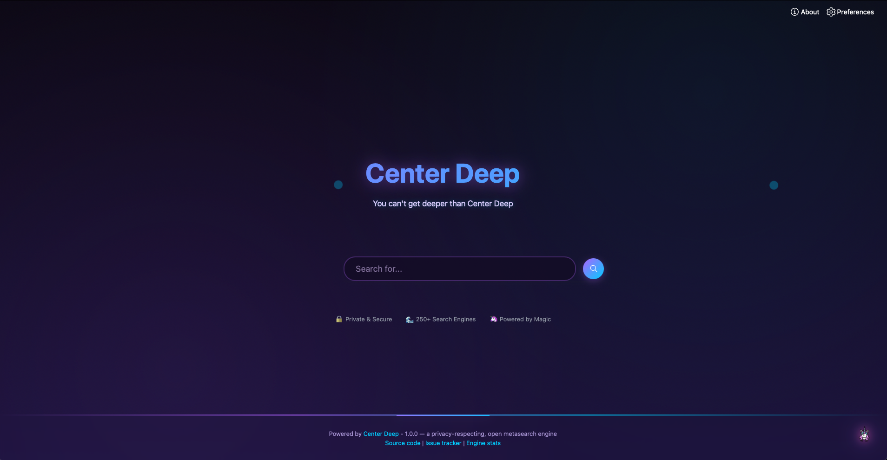
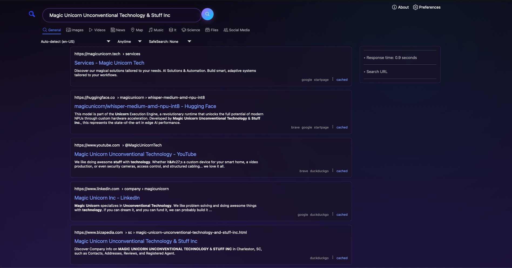

# 🦄 Center Deep - Privacy-First Metasearch Engine

> **You can't get deeper than Center Deep**




## What is Center Deep?

Center Deep is a beautiful, easy-to-deploy, privacy-focused metasearch engine built on SearXNG. It's your gateway to the entire internet without the tracking, profiling, or filter bubbles.

### The Problem We Solve

**Privacy is broken on the web.** Every search you make is tracked, stored, and used to build a profile about you. Search engines trap you in filter bubbles, showing you what they think you want to see rather than what's actually out there.

**Self-hosting is too complex.** Want to run your own private search? Traditional solutions require server administration knowledge, complex configurations, and hours of setup time.

### Our Solution

Center Deep makes private searching simple:

- **One-command installation** - Just run `./install.sh` and you're searching privately in under a minute
- **No tracking, ever** - Your searches stay on your machine, no profiles, no history sent anywhere
- **250+ search engines** - Aggregates results from Google, Bing, DuckDuckGo, and hundreds more
- **Beautiful dark theme** - Not another boring search interface - we built the "Magic Unicorn" theme from scratch
- **Redis-powered performance** - Integrated caching makes searches lightning fast
- **Docker-based** - Runs anywhere Docker runs: your laptop, home server, or cloud VPS

## ✨ Features

🔒 **Complete Privacy** - No tracking, no profiles, no data collection  
🌊 **250+ Search Engines** - Access results from across the entire web  
⚡ **Lightning Fast** - Optimized performance with powerful caching  
🦄 **Beautiful Interface** - Magical purple gradient theme with smooth animations  
🛡️ **Ad-Free & Clean** - Pure search results without distractions  

## 🚀 One-Click Installation

### Prerequisites
- [Docker](https://docs.docker.com/get-docker/)
- [Docker Compose](https://docs.docker.com/compose/install/)

### Install Center Deep

```bash
git clone https://github.com/YourUsername/Center-Deep.git
cd Center-Deep
./install.sh
```

That's it! 🎉

Center Deep will be available at:
- **http://localhost:8888**
- **http://0.0.0.0:8888**

## 🛠️ Manual Installation

If you prefer manual setup:

```bash
# Clone the repository
git clone https://github.com/YourUsername/Center-Deep.git
cd Center-Deep

# Create environment file
cp .env.example .env

# Start Center Deep
docker-compose up --build -d
```

## 📋 Management Commands

```bash
# Start Center Deep
docker-compose up -d

# Stop Center Deep
docker-compose down

# View logs
docker-compose logs -f center-deep

# Restart Center Deep
docker-compose restart

# Update Center Deep
git pull
docker-compose up --build -d
```

## ⚙️ Configuration

Edit the `.env` file to customize your installation:

```bash
# Generate a new secret key
openssl rand -hex 32
```

## 🌐 Access

- **Main Interface**: http://localhost:8888
- **External Access**: http://0.0.0.0:8888 (accessible from other devices on your network)

## 🔒 Privacy

Center Deep is designed with privacy as the top priority:
- Zero user tracking or profiling
- No search history storage
- All searches are encrypted and proxied
- Third-party engines never see your IP address
- Open source and transparent

## 🦄 About Center Deep

Center Deep is our open-source foundation on the path to building **Center Deep Pro** - a next-generation AI-powered search experience. 

This release takes the powerful SearXNG metasearch engine and enhances it with:
- Beautiful magical interface design with custom "Magic Unicorn" theme
- Optimized performance with integrated Redis caching
- Enhanced privacy features - absolutely zero tracking
- 250+ search engine integrations for comprehensive results
- Mobile-responsive design that works everywhere
- One-command Docker deployment

## 🚀 What's Next: Center Deep Pro

We're building the future of search with Center Deep Pro, which will add:
- AI-powered result ranking and summarization
- Custom search algorithms tailored to your needs
- Advanced filtering and search operators
- Team collaboration features
- Developer API access
- And much more...

## 🏢 Company

Built by [Magic Unicorn Unconventional Technology & Stuff Inc](https://magicunicorn.tech)

We like problem solving and doing awesome things with technology. If you can dream it, and you can fund it, we can probably build it.

## 📝 License

Center Deep is open source, built on SearXNG (AGPL-3.0). See [LICENSE](LICENSE) for details.

## 🙏 Acknowledgments

- Built on the excellent [SearXNG](https://github.com/searxng/searxng) project
- Powered by magic and unicorns 🦄
- Redis caching powered by [Redis](https://redis.io) / [Valkey](https://valkey.io)

---

<div align="center">

**🔒 Private & Secure | 🌊 250+ Search Engines | 🦄 Powered by Magic**

**Center Deep v1.0** - Your gateway to the deep web, without the creepy tracking

*You can't get deeper than Center Deep*

</div>