<div align="center">


# 🌊 Center Deep

## **The One-Click Privacy Search Engine**

[](LICENSE_MIT)
[](docker-compose.yml)
[](https://github.com/open-webui/open-webui)
[](https://python.org)
[](https://github.com/Unicorn-Commander/Center-Deep)

### 🦄 **Built by [Magic Unicorn Unconventional Technology & Stuff Inc](https://magicunicorn.tech)**

**Center Deep** is a fork of the excellent SearXNG project, reimagined with a focus on simplicity and ease of deployment. We saw many users struggling with SearXNG's setup process, so we created a one-click solution that just works out of the box while adding modern features like AI integration and a beautiful admin panel.

[**🚀 Get Started**](#-quick-start) • [**📸 Screenshots**](#-screenshots) • [**🆚 Compare Editions**](#-center-deep-vs-center-deep-pro) • [**💬 Community**](#-community--support)

</div>

---

## 🎯 **Why Center Deep?**

We love SearXNG! It's an amazing privacy-focused metasearch engine. But we kept hearing the same feedback:
- "The setup is too complicated"
- "I wish it had a web UI for configuration"
- "Can it integrate with my AI tools?"
- "The interface needs modernization"

**Center Deep** addresses these concerns while maintaining all the privacy features that make SearXNG great.

<table>
<tr>
<td width="50%">

### 🤝 **Built on SearXNG's Foundation**
- Same powerful search aggregation
- Same privacy-first approach
- Same open-source spirit
- Compatible with SearXNG instances

</td>
<td width="50%">

### ✨ **What We Added**
- One-command Docker deployment
- Beautiful web-based admin panel
- AI tool server integration
- Modern, responsive UI
- Automatic configuration
- Built-in user management

</td>
</tr>
</table>

---

## ⚡ **Quick Start**

### 🐳 **Literally One Command**

```bash
# Clone and run - that's it!
git clone https://github.com/Unicorn-Commander/Center-Deep.git && cd Center-Deep
docker compose -f docker-compose.center-deep.yml up -d

# Access at http://localhost:8888
```

**No configuration files. No complex setup. It just works.** ✨

> 🔑 **Admin Panel**: `http://localhost:8888/admin` | Username: `ucadmin` | Password: `MagicUnicorn!8-)`

---

## 🔧 **Redis Configuration Options**

Center Deep uses Redis for caching and performance optimization. We provide flexible options:

### **Option 1: Use Our Included Redis** (Default)
```bash
# Runs Redis on port 6385 (non-standard to avoid conflicts)
docker compose -f docker-compose.center-deep.yml up -d
```

### **Option 2: Use Your Existing Redis**
```bash
# Set environment variables before starting
export USE_EXTERNAL_REDIS=true
export EXTERNAL_REDIS_HOST=localhost
export EXTERNAL_REDIS_PORT=6379
export EXTERNAL_REDIS_DB=2  # Optional: specific database number

docker compose -f docker-compose.center-deep.yml up -d
```

### **Option 3: Configure in .env File**
```env
# Edit .env file
USE_EXTERNAL_REDIS=true
EXTERNAL_REDIS_HOST=your-redis-server
EXTERNAL_REDIS_PORT=6379
EXTERNAL_REDIS_PASSWORD=your-password  # If authentication is required
```

> 💡 **Note**: We use port 6385 by default to avoid conflicts with existing Redis installations

---

## 📸 **Screenshots**

<div align="center">

### **🏠 Clean, Modern Search Interface**


### **🔍 Beautiful Search Results**


### **⚙️ Web-Based Admin Dashboard**


</div>

---

## 🎯 **Core Features**

<div align="center">

| 🔒 **Privacy First** | 🤖 **AI Integration** | 🎨 **Beautiful UI** | ⚙️ **Easy Admin** |
|:---:|:---:|:---:|:---:|
| Zero tracking | 4 OpenWebUI tools | Dark/Light themes | Web-based config |
| No cookies needed | LLM model discovery | Responsive design | User management |
| No ads ever | Tool server control | Unicorn mascot 🦄 | Real-time stats |
| IP rotation ready | Native integration | Clean results | Auto-configuration |

</div>

---

## 🛠️ **Tool Servers for OpenWebUI**

### **AI-Powered Search Enhancement**

<table>
<tr>
<td width="25%">

### 🔍 **Search Tool**
Port: `13050`

Web, GitHub, Reddit, Stack Overflow integration

</td>
<td width="25%">

### 🔬 **Deep Search**
Port: `13051`

Multi-layer analysis with link following

</td>
<td width="25%">

### 📊 **Report Gen**
Port: `13052`

Professional reports with citations

</td>
<td width="25%">

### 🎓 **Academic**
Port: `13053`

Scholarly papers with proper formatting

</td>
</tr>
</table>

### **Simple Integration**

```bash
# Start tool servers
docker compose --profile tools -f docker-compose.center-deep.yml up -d

# Add these URLs to OpenWebUI
http://localhost:13050  # Search Tool
http://localhost:13051  # Deep Search
http://localhost:13052  # Report Generator
http://localhost:13053  # Academic Research
```

---

## 🆚 **Center Deep vs Center Deep Pro**

<div align="center">

### **Choose Your Edition**

| Feature | 🆓 **Center Deep** <br>(Open Source) | 💼 **Center Deep Pro** <br>(Enterprise) |
|:--------|:----------------------------------:|:----------------------------------------:|
| **🔍 Core Search** | ✅ 70+ search engines | ✅ 70+ engines + priority results |
| **🤖 AI Tool Servers** | ✅ 4 basic tools | ✅ Unlimited custom tools |
| **👥 Users** | ✅ Unlimited local users | ✅ SSO/LDAP/OAuth2 |
| **📊 Analytics** | ✅ Basic statistics | ✅ Advanced dashboards + exports |
| **🌐 Proxy Support** | ✅ Basic proxy config | ✅ Rotating proxy pools |
| **📝 Content System** | ❌ | ✅ Blog + Newsletter platform |
| **🔗 API Access** | ✅ Basic API | ✅ Full REST API + webhooks |
| **🎨 Customization** | ✅ Themes | ✅ White-label + custom branding |
| **📞 Support** | Community | 24/7 Enterprise support |
| **💰 Price** | **FREE Forever** | **[Contact Sales](mailto:sales@unicorncommander.com)** |

</div>

> 🚀 **Need enterprise features?** [Get Center Deep Pro](mailto:sales@unicorncommander.com)

---

## 🏗️ **Architecture**

```mermaid
graph LR
    A[👤 User] --> B[Center Deep<br/>:8888]
    C[🤖 OpenWebUI] --> B
    B --> D[Search Engines<br/>70+ sources]
    B --> E[Redis Cache<br/>:6385]
    B --> F[Tool Servers<br/>:13050-13053]
    
    style B fill:#6366f1,stroke:#4f46e5,stroke-width:3px,color:#fff
    style F fill:#10b981,stroke:#059669,stroke-width:2px,color:#fff
```

<div align="center">



</div>

---

## 💪 **Advanced Configuration**

<details>
<summary><b>🔧 Environment Variables</b></summary>

```env
# Redis Configuration
USE_EXTERNAL_REDIS=false        # Use your own Redis instance
EXTERNAL_REDIS_HOST=localhost   # Redis server address
EXTERNAL_REDIS_PORT=6379        # Redis port
EXTERNAL_REDIS_PASSWORD=         # Redis password (if required)
EXTERNAL_REDIS_DB=0             # Redis database number

# Admin Setup
ADMIN_USERNAME=ucadmin
ADMIN_PASSWORD=YourSecurePassword

# Search Engine Settings
SEARCH_TIMEOUT=10               # Search timeout in seconds
MAX_RESULTS=20                  # Maximum results per page
SAFE_SEARCH=moderate            # off, moderate, strict

# LLM Integration (Optional)
SEARCH_LLM_API_BASE=https://api.openai.com/v1
SEARCH_LLM_API_KEY=your-api-key
SEARCH_LLM_MODEL=gpt-4
```

</details>

<details>
<summary><b>🐳 Docker Compose Variants</b></summary>

```bash
# Standard deployment (includes Redis on port 6385)
docker compose -f docker-compose.center-deep.yml up -d

# Use existing Redis
USE_EXTERNAL_REDIS=true docker compose -f docker-compose.center-deep.yml up -d

# Development mode with hot reload
docker compose -f docker-compose.dev.yml up

# Production with SSL/TLS
docker compose -f docker-compose.prod.yml up -d

# With monitoring stack (Prometheus + Grafana)
docker compose --profile monitoring up -d
```

</details>

<details>
<summary><b>🔨 Manual Installation</b></summary>

```bash
# Create virtual environment
python3 -m venv venv && source venv/bin/activate

# Install dependencies
pip install -r requirements.txt

# Configure
cp .env.example .env
nano .env

# Initialize database
python init_admin.py

# Run application
python app.py
```

</details>

---

## 🚀 **Roadmap**

### **Open Source (Forever Free)**
- ✅ Core search functionality from SearXNG
- ✅ Web-based admin dashboard
- ✅ AI tool servers
- ✅ User management
- ✅ Docker one-click deployment
- 🔄 Browser extensions
- 🔄 Mobile apps
- 🔄 Custom search operators

### **Pro Edition (Enterprise)**
- 🎯 AI Agents & Scrapers
- 🎯 Advanced analytics
- 🎯 Full REST API
- 🎯 White-label options
- 🎯 Priority support
- 🎯 Custom integrations
- 🎯 Compliance tools
- 🎯 Audit logging

---

## 🤝 **Contributing**

We welcome contributions! Whether you're fixing bugs, adding features, or improving documentation, we'd love your help.

```bash
# Fork and clone
gh repo fork Unicorn-Commander/Center-Deep

# Create feature branch
git checkout -b feature/awesome-feature

# Make your changes
# ...

# Push and create PR
git push origin feature/awesome-feature
gh pr create
```

See our [Contributing Guide](CONTRIBUTING.md) for details.

---

## 🛡️ **Security**

- 🔐 **Password hashing** with Werkzeug
- 🔒 **Session management** with Flask-Login
- 🛡️ **CSRF protection** on all forms
- 🚫 **Input sanitization** everywhere
- 📦 **Isolated containers** for services
- 🔄 **Regular security updates**

Found a vulnerability? Email `security@unicorncommander.com`

---

## 📚 **Documentation**

<div align="center">

| 📖 [Installation](docs/installation.md) | 🔧 [Configuration](docs/configuration.md) | 🔌 [API Docs](docs/api.md) | 🤖 [Tool Servers](docs/tool-servers.md) | ❓ [FAQ](docs/faq.md) |
|:---:|:---:|:---:|:---:|:---:|

</div>

---

## 💬 **Community & Support**

<div align="center">

### **Join Our Community**

[](https://github.com/Unicorn-Commander/Center-Deep/issues)
[](https://github.com/Unicorn-Commander/Center-Deep/discussions)

</div>

---

## 🙏 **Acknowledgments**

- 🔍 **[SearXNG Team](https://github.com/searxng/searxng)** - For creating the amazing foundation we built upon
- 🦄 **[Magic Unicorn Inc](https://magicunicorn.tech)** - For sponsoring development
- 🤿 **The Unicorn Diver** - Our beloved mascot
- 🌍 **The Community** - For feedback and contributions
- ☕ **Coffee** - The real hero

---

<div align="center">

## ⭐ **Star us if Center Deep makes your search easier!**

---

### **🦄 A [Magic Unicorn](https://magicunicorn.tech) Production**

**[Unicorn Commander](https://unicorncommander.com)** - Enterprise Division

Built with ❤️ and 🦄 to make privacy-first search accessible to everyone

[**Website**](https://center-deep.com) • [**Pro Version**](mailto:sales@unicorncommander.com) • [**Issues**](https://github.com/Unicorn-Commander/Center-Deep/issues)

</div>