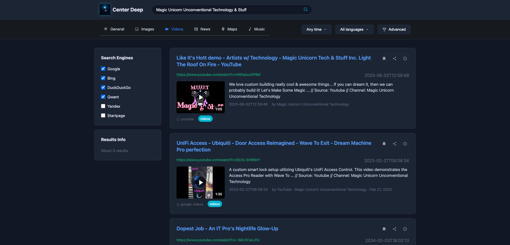
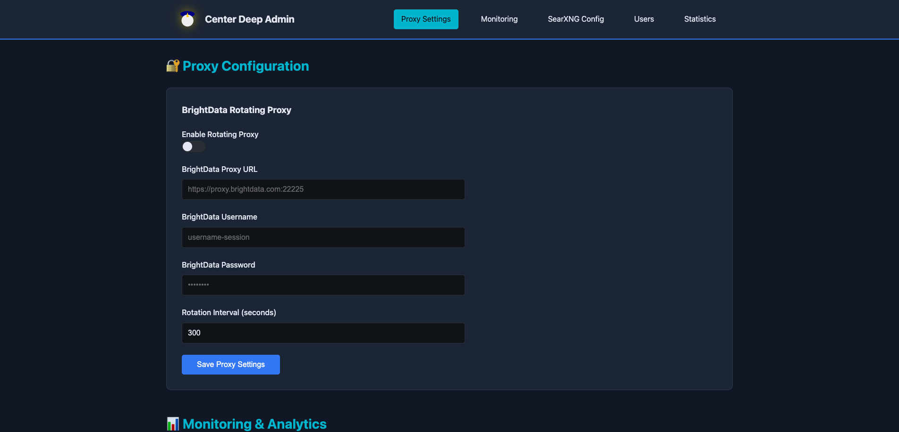

# Center-Deep Pro
### Enterprise Search Intelligence Platform

<div align="center">


**The most advanced search intelligence platform for enterprises**

[](LICENSE)
[](CHANGELOG.md)
[](mailto:support@unicorncommander.com)

[Features](#features) • [Installation](#installation) • [Documentation](#documentation) • [Support](#support)

</div>

---

## 🚀 Overview

Center-Deep Pro is an enterprise-grade search intelligence platform that transforms how organizations discover, analyze, and act on information. Built on advanced search aggregation technology with integrated tool servers, user management, and enterprise features.

### 🏢 Enterprise-Ready
- **Multi-user authentication** with role-based access control
- **Advanced analytics** and search intelligence dashboards  
- **Rotating proxy support** for enterprise-scale operations
- **Content management system** with automated publishing
- **Newsletter platform** for organizational communication

### 🛠️ Tool Servers
Revolutionary search enhancement through specialized tool servers:
- **Academic Research Tool** - Scholarly article discovery and analysis
- **Deep Search Engine** - Multi-layered information discovery
- **Report Generator** - Automated report compilation
- **Search Intelligence** - Enhanced query processing

### 🎯 Key Differentiators
- **Zero external dependencies** - Self-hosted, private search
- **Multi-engine aggregation** - Google, Bing, DuckDuckGo, and more
- **Enterprise security** - No data leaving your infrastructure
- **Customizable branding** - White-label ready
- **API-first architecture** - Integrate with existing systems


## 🚀 Quick Start

### Prerequisites
- Docker & Docker Compose
- 4GB+ RAM recommended
- Modern web browser

### Installation

```bash
# Clone the repository
git clone https://github.com/Unicorn-Commander/Center-Deep.git
cd Center-Deep

# Configure environment
cp .env.example .env
# Edit .env with your settings

# Start the platform
docker-compose up -d

# Access at http://localhost:8888
# Default admin: ucadmin / MagicUnicorn!8-)
```

### Enterprise Deployment

```bash
# Production deployment with SSL
./deploy/production.sh

# With external Redis and PostgreSQL
./deploy/enterprise.sh

# Kubernetes deployment
kubectl apply -f deploy/k8s/
```

---

## ✨ Features

### 🔍 Core Search
- **Universal Search** - Aggregate results from 70+ search engines
- **Real-time Results** - Sub-second response times
- **Advanced Filtering** - Time, language, region, content type
- **Safe Search** - Enterprise content filtering
- **Mobile Responsive** - Optimized for all devices

### 👥 User Management
- **Role-Based Access** - Admin, User, Viewer permissions
- **Single Sign-On** - LDAP/OAuth integration ready
- **User Analytics** - Search behavior insights
- **Session Management** - Secure, trackable sessions
- **API Key Management** - Programmatic access control

### 📊 Analytics & Intelligence
- **Search Analytics** - Query patterns and trends
- **Performance Monitoring** - Response time tracking
- **User Behavior** - Usage patterns and insights
- **Export Capabilities** - CSV, JSON, PDF reports
- **Real-time Dashboards** - Live operational metrics

### 🌐 Enterprise Networking
- **Rotating Proxies** - Scale without rate limiting
- **Load Balancing** - High-availability deployment
- **Caching Layer** - Redis-powered performance
- **API Gateway** - Centralized access management
- **Health Monitoring** - Automated service checks

### 📝 Content Management
- **Blog Platform** - Integrated content publishing
- **Newsletter System** - Automated distribution
- **Content Agents** - Automated content generation
- **SEO Optimization** - Built-in search optimization
- **Template System** - Customizable layouts

### 🔧 Tool Servers
- **Academic Research** - Scholarly search enhancement
- **Deep Search** - Multi-layer information discovery  
- **Report Generation** - Automated document creation
- **Custom Tools** - Extensible plugin architecture

---

## 🆚 Center-Deep vs Unicorn Search

| Feature | Unicorn Search (Open Source) | Center-Deep Pro (Enterprise) |
|---------|------------------------------|------------------------------|
| **Core Search** | ✅ Basic search aggregation | ✅ Advanced search with analytics |
| **Tool Servers** | ✅ 4 basic tools | ✅ Full tool suite + custom tools |
| **User Management** | ❌ Single user | ✅ Multi-user with RBAC |
| **Analytics** | ❌ Basic stats only | ✅ Advanced analytics & reporting |
| **Proxy Support** | ❌ None | ✅ Enterprise rotating proxies |
| **Content Management** | ❌ None | ✅ Blog + Newsletter system |
| **API Access** | ✅ Basic API | ✅ Full API with key management |
| **Support** | 🌐 Community | 📞 Enterprise support |
| **Licensing** | 🆓 MIT License | 💼 Commercial license |

**→ Try [Unicorn Search](https://github.com/MagicUnicornInc/Unicorn-Search) for basic needs**

---

### 🔍 Enhanced Search Platform
- **Enterprise Admin Dashboard**: Complete control panel for system administrators
- **Rotating Proxy Support**: Built-in BrightData proxy integration for enhanced anonymity
- **Advanced Monitoring**: Prometheus and Grafana integration for real-time metrics
- **User Management**: Multi-user support with role-based access control
- **Professional UI**: Modern dark theme optimized for extended use
- **Real-time Analytics**: Live search statistics and usage monitoring

### 🤖 AI-Powered Tool Servers
- **OpenAI API v1 Compatible**: Works seamlessly with Open WebUI and other AI platforms
- **Docker-Based Architecture**: Each tool runs in its own container for scalability
- **LLM Configuration**: Assign different AI models to different tools
- **Admin Dashboard Control**: Start/stop/manage tool servers from the web interface

#### Available Tool Servers:
1. **Search Tool** (Port 8001)
   - Web search across multiple engines
   - GitHub, Reddit, Stack Overflow integration
   - Quick information retrieval

2. **Deep Search** (Port 8002)
   - Multi-level search with link following
   - Content extraction and analysis
   - Comprehensive research capabilities

3. **Report Generator** (Port 8003)
   - Professional report creation
   - Executive, technical, and analytical formats
   - Automatic citations and formatting

4. **Academic Research** (Port 8004)
   - Formal academic paper generation
   - APA, MLA, Chicago, IEEE citation styles
   - Literature review and bibliography

### 🔎 Search Capabilities
- **Multi-Engine Aggregation**: Simultaneous search across Google, Bing, DuckDuckGo, Qwant, and more
- **Category-Specific Results**: Optimized layouts for Images, Videos, News, Maps, and Music
- **Advanced Filtering**: Time range, language, and safe search controls
- **Privacy Options**: Optional client-side data storage for enhanced privacy

## Screenshots

### Search Results


### Image Search


### Video Results


### Settings Page


### Full Search Results View


### Complete Settings Interface


## Installation

### Automated Installation (Recommended)

Use our installation script for a complete setup:

```bash
./install.sh
```

The installer will:
- Check prerequisites (Docker, Docker Compose)
- Create necessary directories and configurations
- Build all Docker images
- Start Redis and SearXNG services
- Launch Center Deep application
- Provide access URLs and credentials

### Manual Installation

1. **Prerequisites**
   - Docker and Docker Compose
   - Python 3.11+ (for local development)
   - Git

2. **Clone and Setup**
```bash
git clone https://github.com/Unicorn-Commander/Center-Deep.git
cd Center-Deep
```

3. **Configure Environment**
```bash
cp .env.example .env
# Edit .env with your settings
```

4. **Build Images**
```bash
# Build main application
docker build -t center-deep:latest .

# Build tool servers
for tool in search deep-search report academic; do
    docker build -t center-deep-tool-$tool:latest ./toolserver/$tool
done
```

5. **Start Services**
```bash
# Start infrastructure
docker-compose up -d

# Start tool servers (optional)
docker-compose -f docker-compose.tools.yml up -d
```

6. **Access Application**
   - Main App: http://localhost:8890
   - Admin: http://localhost:8890/admin
   - SearXNG: http://localhost:8888

## 🔐 Security & Credentials

### Default Login
- Username: `ucadmin`
- Password: `MagicUnicorn!8-)`

**Important**: Change the default password immediately after first login.

### Security Features
- Password hashing with Werkzeug
- Session-based authentication
- Role-based access control
- Optional proxy support for anonymity
- Isolated Docker containers for tool servers

## ⚙️ Configuration

### Admin Dashboard Features

Access the comprehensive admin dashboard at `/admin` to manage:

#### 🔐 Proxy Settings
- Configure BrightData rotating proxies
- Set rotation intervals
- Monitor proxy status

#### 📊 Monitoring Integration
- Prometheus metrics export
- Grafana dashboard configuration
- Real-time performance tracking

#### 🔍 SearXNG Configuration
- Customize search engines
- Set default parameters
- Configure result limits

#### 🤖 LLM Configuration
- Add multiple LLM providers (OpenAI, Anthropic, etc.)
- Assign different models to different tools
- Configure temperature and token limits

#### 🛠️ Tool Server Management
- Start/stop individual tool servers
- View container logs
- Monitor health status
- Get integration URLs for Open WebUI

#### 👥 User Management
- Create and manage users
- Set admin privileges
- Password management
- Activity monitoring

### Search Preferences

Users can customize their search experience through the preferences page:

- Safe search settings
- Results per page
- Enabled search engines
- Theme and language preferences
- Local data tracking options

## 🏗️ Architecture

### Core Components
- **Backend**: Flask with SQLAlchemy for database management
- **Search Engine**: SearXNG metasearch engine integration
- **Database**: SQLite for user data and search logs
- **Caching**: Redis for real-time statistics and performance
- **Authentication**: Flask-Login for secure session management

### Tool Server Architecture
- **Framework**: FastAPI for high-performance API endpoints
- **Containerization**: Each tool runs in isolated Docker container
- **API Standard**: OpenAI API v1 compatible for broad integration
- **Communication**: RESTful APIs with JSON responses
- **Scalability**: Independent scaling of each tool server

### Integration with Open WebUI

Add these endpoints to Open WebUI's tool configuration:

```
http://localhost:8001  # Search Tool
http://localhost:8002  # Deep Search
http://localhost:8003  # Report Generator
http://localhost:8004  # Academic Research
```

## 🛠️ Development

### Project Structure
```
Center-Deep/
├── app.py                    # Main Flask application
├── docker-compose.yml        # Main services configuration
├── docker-compose.tools.yml  # Tool servers configuration
├── install.sh               # Automated installation script
├── requirements.txt         # Python dependencies
├── Dockerfile              # Main app container
├── templates/              # HTML templates
│   ├── admin.html         # Admin dashboard
│   ├── index.html         # Search homepage
│   └── search.html        # Search results
├── static/                 # Static assets
│   ├── css/              # Stylesheets
│   └── images/           # Logo and image assets
├── toolserver/            # AI Tool Servers
│   ├── search/           # Basic search tool
│   ├── deep-search/      # Deep analysis tool
│   ├── report/           # Report generator
│   └── academic/         # Academic paper tool
└── instance/              # Database (created on first run)
```

### Development Setup

1. **Create Virtual Environment**
```bash
python -m venv venv
source venv/bin/activate  # On Windows: venv\Scripts\activate
```

2. **Install Dependencies**
```bash
pip install -r requirements.txt
```

3. **Run in Development Mode**
```bash
export FLASK_ENV=development
python app.py
```

## 🔒 Security & Privacy

### Security Measures
- Password hashing with Werkzeug's PBKDF2
- Secure session management with Flask-Login
- CSRF protection on all forms
- Input validation and sanitization
- Isolated Docker containers for each service

### Privacy Features
- No tracking by default
- Optional client-side data storage
- Rotating proxy support
- Anonymous search capabilities
- No personal data collection without consent

### Best Practices
- Regular security updates
- Environment variable for secrets
- Minimal container privileges
- Network isolation between services

## 💼 Licensing & Support

### Commercial License
Center-Deep Pro is available under a commercial license for enterprise use. Contact us for:

- **Volume discounts** for large deployments
- **Custom development** and feature requests  
- **Professional services** and implementation support
- **Training programs** for your team

### Support Tiers

| Tier | Response Time | Channels | Included |
|------|---------------|----------|----------|
| **Enterprise** | 4 hours | Email, Phone, Slack | Setup, Training, Updates |
| **Enterprise+** | 1 hour | All + Video Call | Custom Development |
| **White Glove** | 15 minutes | All + Dedicated Rep | Full Management |

### Contact Information
- **Sales**: sales@unicorncommander.com
- **Support**: support@unicorncommander.com  
- **Demo Request**: https://unicorncommander.com/demo
- **Documentation**: https://docs.unicorncommander.com

---

## 🤝 Contributing

### Enterprise Partners
We work with select partners for:
- **System Integration** services
- **Custom Development** projects
- **Training and Certification** programs
- **Reseller Partnerships**

### Community
- **Feature Requests** - Submit via GitHub Issues
- **Bug Reports** - Include reproduction steps
- **Documentation** - Help improve our guides
- **Feedback** - Share your use cases and suggestions

---

## 📄 License

Center-Deep Pro is proprietary software licensed for commercial use.

**Evaluation License**: 30-day free trial for evaluation purposes  
**Development License**: For development and testing environments  
**Production License**: For live enterprise deployments

See [LICENSE](LICENSE) for full terms and conditions.

For open-source alternatives, see [Unicorn Search](https://github.com/MagicUnicornInc/Unicorn-Search).

---

## 🏢 About Unicorn Commander

Center-Deep Pro is developed by **Unicorn Commander**, the enterprise division of **Magic Unicorn Unconventional Technology & Stuff Inc**.

We specialize in enterprise search intelligence, private data discovery, and custom search platform development for organizations that demand the highest levels of security, performance, and customization.

**Learn more**: https://unicorncommander.com

---

<div align="center">

**Ready to transform your organization's search capabilities?**

[**Request Demo**](https://unicorncommander.com/demo) • [**Start Trial**](https://unicorncommander.com/trial) • [**Contact Sales**](mailto:sales@unicorncommander.com)

---

© 2025 Unicorn Commander. All rights reserved.

</div>

### Technologies Used
- Flask & FastAPI
- Docker & Docker Compose
- SearXNG Metasearch Engine
- Redis for caching
- SQLite/PostgreSQL for data
- Modern JavaScript & CSS

---

*For licensing inquiries, contact Magic Unicorn Unconventional Technology & Stuff Inc.*