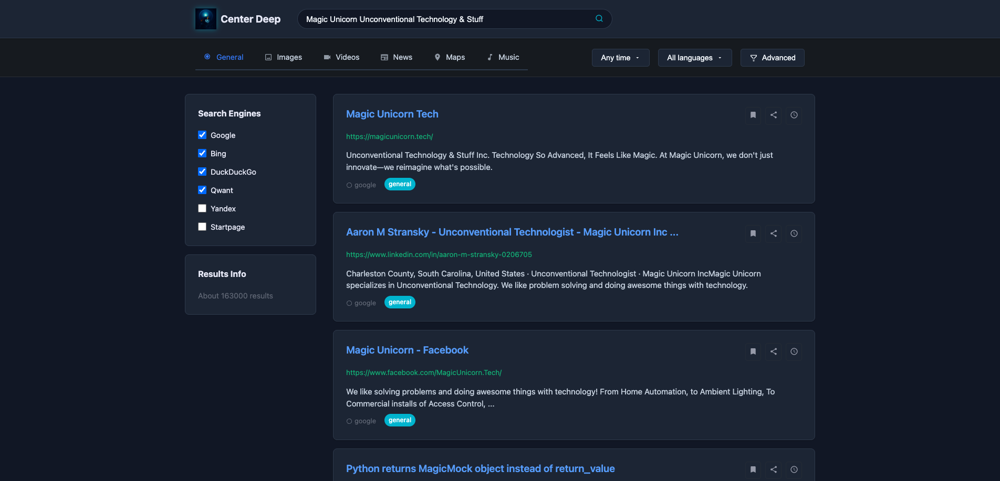

# Center Deep 🦄
### Privacy-First Open Source Metasearch Engine

<div align="center">


**Dive deep into the web with privacy and style**

[](LICENSE)
[](docker-compose.yml)
[](https://github.com/open-webui/open-webui)

[Features](#features) • [Quick Start](#quick-start) • [Screenshots](#screenshots) • [Documentation](#documentation)

</div>

---

## 🌊 Overview

Center Deep is a privacy-focused metasearch engine that aggregates results from 70+ search engines while keeping your data private. Features a beautiful dark theme with our iconic unicorn deep-diver mascot, advanced proxy support, and AI-powered tool servers for enhanced search capabilities.

### ✨ Key Features

- 🔍 **Multi-Engine Search** - Aggregate results from Google, Bing, DuckDuckGo, and 70+ engines
- 🔒 **Privacy First** - No tracking, no profiling, no data collection
- 🦄 **Beautiful UI** - Dark ocean theme with the iconic Center Deep unicorn
- 🔄 **Rotating Proxy Support** - Built-in BrightData proxy integration
- 🤖 **AI Tool Servers** - OpenWebUI compatible tools for enhanced search
- ⚡ **Redis Caching** - Lightning-fast cached results
- 🛠️ **Admin Dashboard** - Configure proxies, monitoring, and more
- 📊 **Real-time Stats** - Search analytics and usage monitoring

## 🚀 Quick Start

### One-Line Install

```bash
curl -sSL https://raw.githubusercontent.com/SkyBehind/Center-Deep/main/install.sh | bash
```

### Manual Installation

```bash
# Clone the repository
git clone https://github.com/SkyBehind/Center-Deep.git
cd Center-Deep

# Run the installer
./install.sh

# Access at http://localhost:8890
```

The installer automatically:
- ✅ Checks prerequisites (Docker, Docker Compose)
- ✅ Creates necessary configurations
- ✅ Builds all Docker images
- ✅ Starts Redis and SearXNG services
- ✅ Launches Center Deep application

## 📸 Screenshots

### Main Search Interface


### Search Results


### Admin Dashboard
Configure rotating proxies, tool servers, and more through the intuitive admin interface.

## 🛠️ Configuration

### Admin Dashboard (http://localhost:8890/admin)

Access the admin panel to configure:

- **🔐 Proxy Settings** - BrightData rotating proxy configuration
- **📊 Monitoring** - Prometheus/Grafana integration
- **🔍 Search Engines** - Enable/disable specific engines
- **🤖 Tool Servers** - Manage AI-powered search tools
- **👥 Users** - Multi-user support with role management

### Environment Variables

Edit `.env` file for basic configuration:

```env
# Flask Configuration
SECRET_KEY=your-secret-key-here

# Redis Configuration
REDIS_HOST=redis
REDIS_PORT=6379

# Optional: LLM API Keys for Tool Servers
SEARCH_LLM_API_KEY=your-api-key
```

## 🤖 AI Tool Servers

Center Deep includes OpenWebUI-compatible tool servers for enhanced search capabilities:

### Available Tools

| Tool | Port | Description |
|------|------|-------------|
| **Search Tool** | 8001 | Basic web search with AI enhancement |
| **Deep Search** | 8002 | Multi-layer analysis and link following |
| **Report Generator** | 8003 | Create professional reports from search results |
| **Academic Research** | 8004 | Generate academic papers with citations |

### OpenWebUI Integration

Add these endpoints to OpenWebUI:
```
http://localhost:8001  # Search Tool
http://localhost:8002  # Deep Search
http://localhost:8003  # Report Generator
http://localhost:8004  # Academic Research
```

### Starting Tool Servers

```bash
# Start all tool servers
docker-compose -f docker-compose.tools.yml up -d

# Or manage individually from the admin dashboard
```

## 🐳 Docker Services

Center Deep uses a microservices architecture with Docker:

```yaml
services:
  redis:         # High-performance caching
  searxng:       # Metasearch engine backend
  center-deep:   # Main application
  tool-servers:  # AI-powered search tools
```

### Service Management

```bash
# Start all services
docker-compose up -d

# View logs
docker-compose logs -f

# Stop services
docker-compose down

# Restart a service
docker-compose restart center-deep
```

## 🔧 Advanced Features

### Rotating Proxy Configuration

1. Open Admin Dashboard → Proxy Settings
2. Enter your BrightData credentials:
   - Proxy URL: `https://proxy.brightdata.com:22225`
   - Username: Your BrightData username
   - Password: Your BrightData password
3. Set rotation interval (default: 300 seconds)
4. Enable proxy rotation

### Custom Search Engines

Edit `searxng/settings.yml` to add/remove search engines:

```yaml
engines:
  - name: custom_engine
    engine: xpath
    search_url: https://example.com/search?q={query}
    # ... additional configuration
```

### Monitoring & Analytics

Enable Prometheus metrics export:
1. Admin Dashboard → Monitoring
2. Enable Prometheus metrics
3. Configure Grafana dashboards for visualization

## 🏗️ Architecture

```
Center Deep/
├── app.py                    # Flask application
├── docker-compose.yml        # Main services
├── docker-compose.tools.yml  # Tool servers
├── templates/               
│   ├── index.html           # Beautiful search homepage
│   ├── search.html          # Results page
│   └── admin.html           # Admin dashboard
├── static/
│   ├── css/                 # Dark ocean theme
│   └── images/              # Unicorn logo assets
├── toolserver/              # AI tool servers
│   ├── search/
│   ├── deep-search/
│   ├── report/
│   └── academic/
└── searxng/                 # Search engine config
```

## 🔒 Privacy & Security

- **No Tracking** - Zero telemetry or user tracking
- **No Data Collection** - Your searches stay private
- **Local Storage** - All data stored locally
- **Proxy Support** - Hide your IP with rotating proxies
- **Open Source** - Fully auditable code

## 🤝 Contributing

We welcome contributions! Please feel free to submit pull requests.

### Development Setup

```bash
# Clone repo
git clone https://github.com/SkyBehind/Center-Deep.git
cd Center-Deep

# Create virtual environment
python -m venv venv
source venv/bin/activate

# Install dependencies
pip install -r requirements.txt

# Run in development mode
export FLASK_ENV=development
python app.py
```

### Areas for Contribution

- 🎨 UI/UX improvements
- 🔍 Additional search engines
- 🌍 Internationalization
- 📚 Documentation
- 🐛 Bug fixes
- ⚡ Performance optimizations

## 📄 License

This project is licensed under the MIT License - see the [LICENSE](LICENSE) file for details.

## 🙏 Acknowledgments

- Built with [SearXNG](https://github.com/searxng/searxng) metasearch engine
- Unicorn artwork by the amazing Center Deep community
- Inspired by the need for privacy in the digital age

## 🔗 Links

- [GitHub Repository](https://github.com/SkyBehind/Center-Deep)
- [Issue Tracker](https://github.com/SkyBehind/Center-Deep/issues)
- [Docker Hub](https://hub.docker.com/r/skybehind/center-deep)

---

<div align="center">

**Made with 🦄 by the Center Deep Community**

*Dive deep, stay private*

</div>